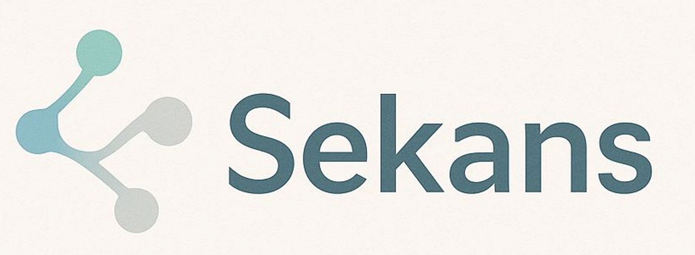

# SEKANS-Bankruptcy-Contagion-Simulation-in-SME-Financial-Networks

KOBİ’ler arasındaki alacak-borç ilişkilerinden oluşan finansal ağ yapısını analiz ederek, olası iflasların sistem genelinde nasıl yayılabileceğini simüle ettiğimiz bu projede; finansal çöküş riskini erken tespit etmeye ve iflas zincirini öngörmeye yönelik bir model geliştirdik.

In this project, we analyzed the financial network structure formed by credit-debt relationships among SMEs. By simulating how potential bankruptcies could spread throughout the system, we developed a model aimed at early detection of financial collapse risks and prediction of bankruptcy contagion.
# 💥 SEKANS: Bankruptcy Prediction & Contagion Simulation in SME Financial Networks

**SEKANS** is a financial network analysis tool that predicts bankruptcies among Small and Medium-Sized Enterprises (SMEs) and simulates the contagion of financial distress through their inter-company financial ties.

---

## 📌 Overview

SEKANS models how financial shocks (e.g., bankruptcies) propagate across a network of SMEs connected by account receivables/payables. It combines:
- **Bankruptcy prediction** via machine learning
- **Graph-based metrics** to assess network fragility
- **Contagion simulation** to observe failure cascades

---

## 📊 Key Features

- 🔍 **Two-step bankruptcy prediction** model using financial indicators and network features
- 🌐 **Graph analysis** (PageRank, Betweenness, Fragility Index)
- 💣 **Contagion simulation** using initial defaulted nodes and spread rules
- 📈 Visualizations for contagion dynamics and network health

---

## 🧪 Technologies Used

- Python (Pandas, NumPy)
- NetworkX, Matplotlib, Seaborn

---
